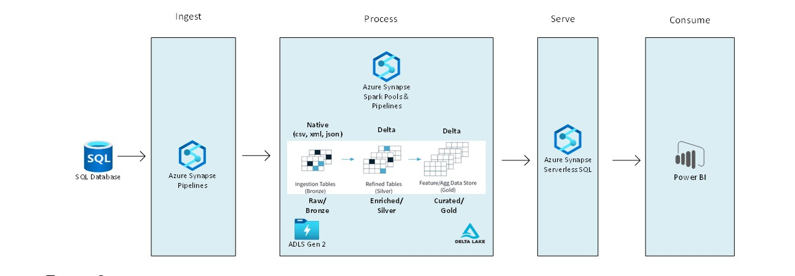
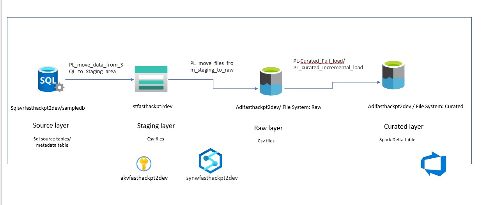
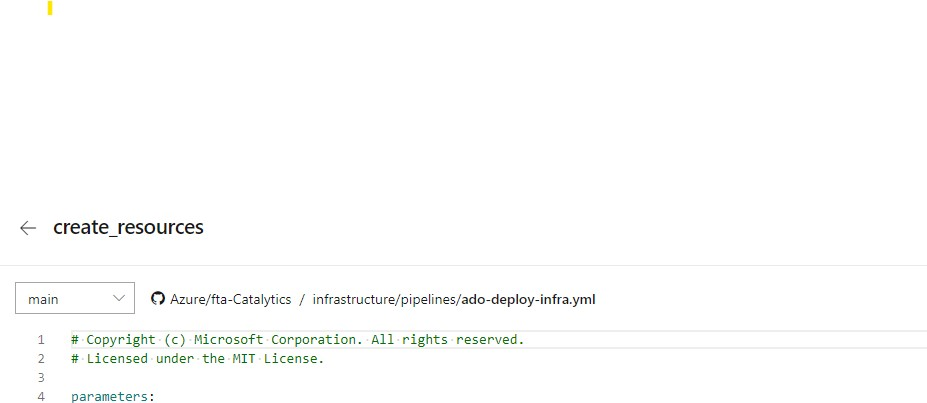
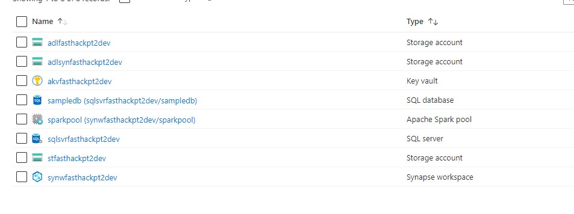

# Azure Synapse Data Lake Demo Environment ( Pattern 1)

## Prerequisites

* An active Azure subscription.
* An active DevOps account to use the Azure pipelines to deploy the resources.
* Service Principal has to be created and should be given Owner access over subscription, so that it can create new resource group and resources during the deployment. 
If "Owner" access can't be given, then assign it to a custom role which has access to the following:

  Microsoft.Authorization/roleAssignments/
* [create a Azure Resource Manager service connection](https://docs.microsoft.com/en-us/azure/devops/pipelines/library/service-endpoints?view=azure-devops&tabs=yaml#create-a-service-connection) from the Azure DevOps pipeline to connect the Azure subscription. 
* [create a github service connectoon](https://docs.microsoft.com/en-us/azure/devops/pipelines/library/service-endpoints?view=azure-devops&tabs=yaml#github-service-connection) to connect to the github repo.

## Architecture

## Resource Diagram

Here are the Azure resources that are going to be deployed using the devops pipeline. 

## Deployment Steps

1. clone the repo: https://github.com/Azure/fta-Catalytics.git
2. change the configuration file: ./config-infra-dev.yml

  location: eastus 
  prefix: fasthack 
  postfix: pt2
  environment: dev
  objectID: '<< object ID of the service principal'
  ado_service_connection_rg: Azure-ARM-Dev-SAPA
  gihub_repo_name: "Azure/fta-Catalytics"

3. Go to the Azure DevOps and map the yml file from the repo
   
4. Save and Run. It would be prompting for the SQL Server password and provide the password. 
5.  4 stages are going to executed.  
     
6. Here are the resource that are going to get created post the deployment.

## Post Deployment
   1. Add your account as the synapse workspace admin. Otherwise, you will not be able to see the pipelines and the other components when you open the synapse workspace. Synapse workspace > Access Control -> add your logged in account as "Synapse Administrator"
   2. Run the master pipleine from the Azure synapse pipeline. Provide the required parameter Date to current date "YYYY-MM-DD" format.
   

## Contributing

This project welcomes contributions and suggestions.  Most contributions require you to agree to a
Contributor License Agreement (CLA) declaring that you have the right to, and actually do, grant us
the rights to use your contribution. For details, visit https://cla.opensource.microsoft.com.

When you submit a pull request, a CLA bot will automatically determine whether you need to provide
a CLA and decorate the PR appropriately (e.g., status check, comment). Simply follow the instructions
provided by the bot. You will only need to do this once across all repos using our CLA.

This project has adopted the [Microsoft Open Source Code of Conduct](https://opensource.microsoft.com/codeofconduct/).
For more information see the [Code of Conduct FAQ](https://opensource.microsoft.com/codeofconduct/faq/) or
contact [opencode@microsoft.com](mailto:opencode@microsoft.com) with any additional questions or comments.

## Trademarks

This project may contain trademarks or logos for projects, products, or services. Authorized use of Microsoft 
trademarks or logos is subject to and must follow 
[Microsoft's Trademark & Brand Guidelines](https://www.microsoft.com/en-us/legal/intellectualproperty/trademarks/usage/general).
Use of Microsoft trademarks or logos in modified versions of this project must not cause confusion or imply Microsoft sponsorship.
Any use of third-party trademarks or logos are subject to those third-party's policies.
